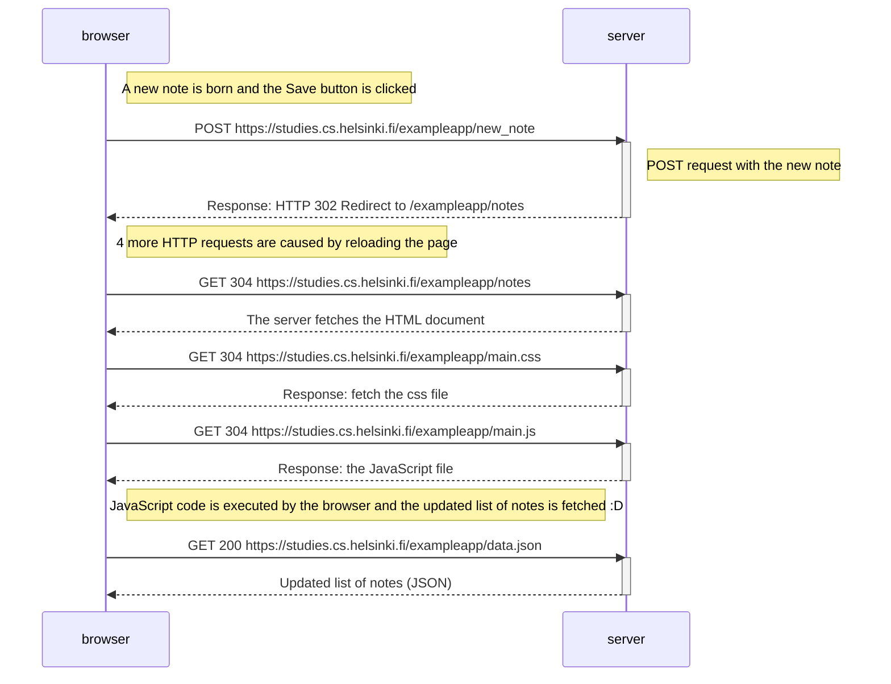

```mermaid
sequenceDiagram
    participant browser
    participant server

    Note right of browser: A new note is born and the Save button is clicked

    browser->>server: POST https://studies.cs.helsinki.fi/exampleapp/new_note
        activate server
        Note right of server: POST request with the new note
        server-->>browser: Response: HTTP 302 Redirect to /exampleapp/notes
        deactivate server

    Note right of browser: 4 more HTTP requests are caused by reloading the page

    browser->>server: GET 304 https://studies.cs.helsinki.fi/exampleapp/notes
        activate server
        server-->>browser: The server fetches the HTML document
        deactivate server

    browser->>server: GET 304 https://studies.cs.helsinki.fi/exampleapp/main.css
        activate server
        server-->>browser: Response: fetch the css file
        deactivate server

    browser->>server: GET 304 https://studies.cs.helsinki.fi/exampleapp/main.js
        activate server
        server-->>browser: Response: the JavaScript file
        deactivate server

    Note right of browser: JavaScript code is executed by the browser and the updated list of notes is fetched :D

    browser->>server: GET 200 https://studies.cs.helsinki.fi/exampleapp/data.json
        activate server
        server-->>browser: Updated list of notes (JSON)
        deactivate server

```
