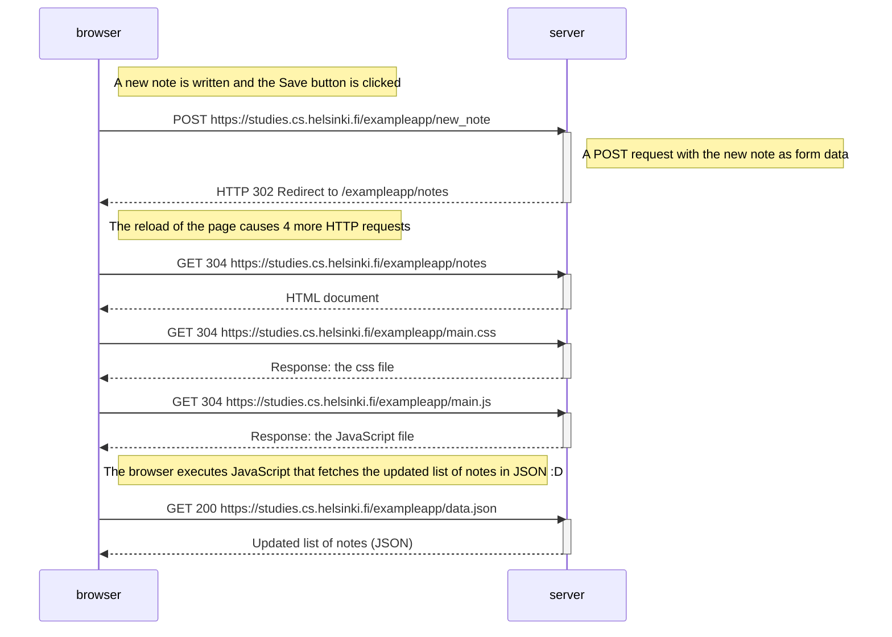

```mermaid
sequenceDiagram
    participant browser
    participant server

    Note right of browser: A new note is written and the Save button is clicked

    browser->>server: POST https://studies.cs.helsinki.fi/exampleapp/new_note
        activate server
        Note right of server: A POST request with the new note as form data
        server-->>browser: HTTP 302 Redirect to /exampleapp/notes
        deactivate server

    Note right of browser: The reload of the page causes 4 more HTTP requests

    browser->>server: GET 304 https://studies.cs.helsinki.fi/exampleapp/notes
        activate server
        server-->>browser: HTML document
        deactivate server

    browser->>server: GET 304 https://studies.cs.helsinki.fi/exampleapp/main.css
        activate server
        server-->>browser: Response: the css file
        deactivate server

    browser->>server: GET 304 https://studies.cs.helsinki.fi/exampleapp/main.js
        activate server
        server-->>browser: Response: the JavaScript file
        deactivate server

    Note right of browser: The browser executes JavaScript that fetches the updated list of notes in JSON :D

    browser->>server: GET 200 https://studies.cs.helsinki.fi/exampleapp/data.json
        activate server
        server-->>browser: Updated list of notes (JSON)
        deactivate server

```
